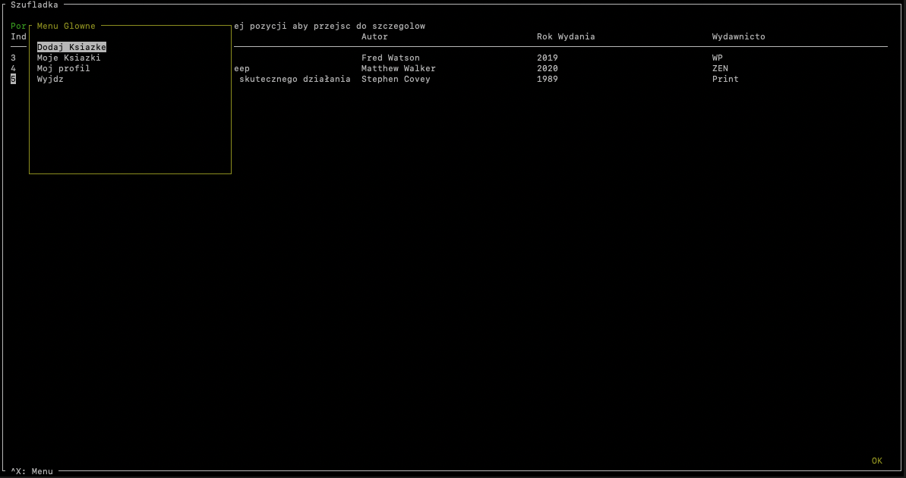

# szufladka-booker

## PL

### Aplikacja obsługująca publiczną wypożyczalnie książek.

#### Główne funkcjonalności:

* rejestracja/logowanie
* przeglądanie listy dostępnych książek
* profil użytkownika
* przeglądanie listy wypożyczonych przez siebie książek
* wypożyczanie dostępnej książki
* oddanie książki wypożyczonej
* dodanie książki do zbioru książek

### Srodowisko

#### Klasycznie jak w niemal każdym projekcie pythonowym:

1. Pull/form repo
2. Aktywuj venv
3. pip install -r requirements.txt
4. python main.py

#### Znane błędy:

1. Mechanizm odświeżania tokena nie jest jeszcze zaimplementowany, sesja wygasa po 5 minutach
2. Logowanie po rejestracji w aplikacji nie działa, backend mówi że uzytkownik nie istnieje pomimo tego że istnieje,
   obejść to można dodając uzytkownika z panelu administracyjnego django

## EN

### An application that supports a public book lending library.

#### Main functionalities:

* registration/logging in.
* browsing the list of available books
* user profile
* browsing through a list of borrowed books.
* borrowing an available book
* returning a borrowed book
* adding a book to the collection of books

## Environment

#### As usual in almost every python project:

1. Pull/fork repo
2. Activate venv
3. pip install -r requirements.txt
4. python main.py

Backend: https://github.com/ShazeRx/szufladka-booker-be

#### Known issues:

1. JWT token refresh mechanism is not implemented for now, so after 5 minutes token is expired
2. Logging in after registration in app does not work for now (user exists but backend says that he does not), way
   around for that is to create user within django admin panel

## Logowanie / Login

## Rejestracja / Register

## Ekran Główny / Main Screen

## Szczegóły dostępnej książki / Details of available book

# Wypożyczanie / Borrowing

# Menu główne / Main menu

# Wypozyczone ksiazki / Borrowed books

## Profil / Profile

